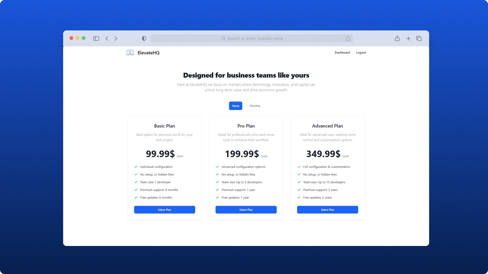
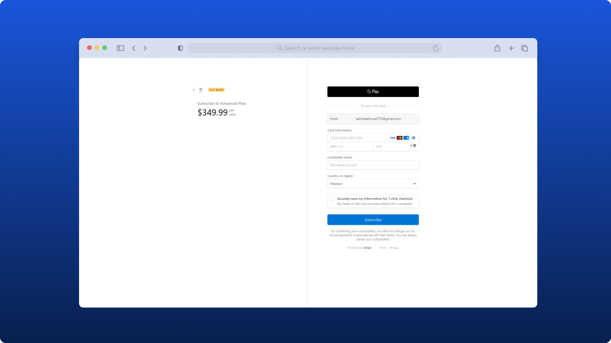
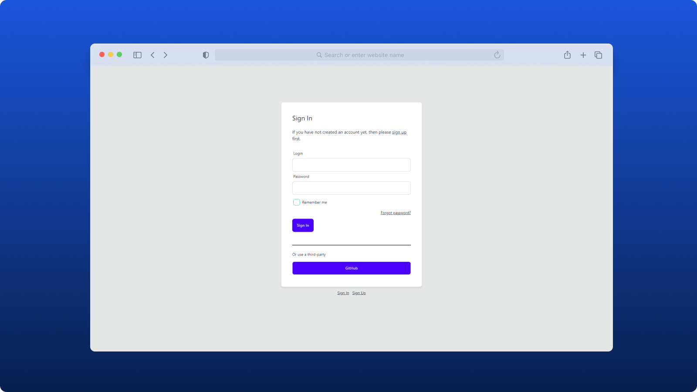
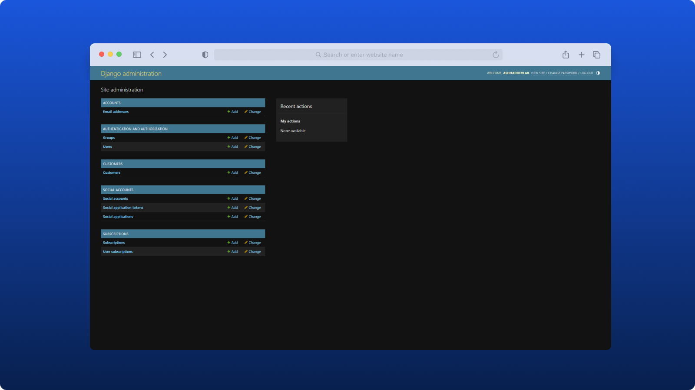

# ElevateHQ

## Description

ElevateHQ is a web-based application designed to manage payment processing, sales tax compliance, and other essential business functions. This project integrates Stripe for payments, Postgres as the database (using Neon serverless Postgres), and Gmail for email functionality.

<p align="center">
    
</p>

### Features

- **Stripe Integration**: Supports both Stripe Checkout and subscription management, allowing users to make payments and manage their subscriptions easily.
- **Authentication**: User authentication is handled by Django Allauth, which supports traditional logins and third-party logins via GitHub, Google, Apple, and more.
- **Email Service**: Integrated with Gmail SMTP for sending transactional and notification emails.
- **Dashboard**: Manage payments, subscriptions, and user interactions with ease.
- **PostgreSQL Database**: Reliable and scalable database management using [Neon Serverless Postgres](https://neon.tech/).
- **Security**: Uses environment variables to handle sensitive information securely.

## Installation

1. Clone the repository:

   ```bash
   git clone https://github.com/AshhadDevLab/elevate-hq.git
   ```

2. Navigate to the project directory:

   ```bash
   cd elevate-hq
   ```

3. Set up a virtual environment and activate it:

   ```bash
   python -m venv env
   source env/bin/activate  # Linux/MacOS
   env\Scripts\activate  # Windows
   ```

4. Install the required dependencies:

   ```bash
   pip install -r requirements.txt
   ```

5. Set up the `.env` file:

   Create a `.env` file in the root directory and add the following content:

   ```bash
    SECRET_KEY=  # Your Django secret key here
    DEBUG=  # True or False
    DATABASE_URL=""  # Your Neon database URL here
    EMAIL_HOST=""  # Your email host here
    EMAIL_PORT=  # Your email port here
    EMAIL_HOST_USER=""  # Your email host user here
    EMAIL_HOST_PASSWORD=""  # Your email host password here
    EMAIL_USE_TLS=  # True or False
    EMAIL_USE_SSL=  # True or False
    ADMIN_USER_NAME=""  # Your admin username here
    ADMIN_USER_EMAIL=""  # Your admin user email here
    STRIPE_SECRET_KEY=""  # Your Stripe secret key here
    BASE_URL=""  # Your base URL here
   ```

## Usage

1. Run migrations to set up the database schema:

   ```bash
   python manage.py migrate
   ```

2. Create an admin user to access the Django admin panel:

   ```bash
   python manage.py createsuperuser
   ```

   Follow the prompts to set up your admin username, email, and password.

3. Pull the required CSS and JS files using the `vendor_pull` command:

   ```bash
   python manage.py vendor_pull
   ```

   This command downloads and stores the necessary frontend static files (CSS and JS) locally in the project.

4. Start the development server:

   ```bash
   python manage.py runserver
   ```

5. Visit [http://127.0.0.1:8000](http://127.0.0.1:8000) to access the application locally.

## Screenshots

<table align="center">
  <tr>
    <td>
      
    </td>
    <td>
      
    </td>
  </tr>
  <tr>
    <td>
      
    </td>
    <td>
      
    </td>
  </tr>
  <tr>
    <td>
      
    </td>
    <td>
      
    </td>
  </tr>
</table>

## Deployment

1. Set the environment variables for production:

   ```bash
   DEBUG=False
   ALLOWED_HOSTS=<your-production-domain>
   ```

2. Update the `DATABASE_URL` for the production database.

3. Collect static files for production:

   ```bash
   python manage.py collectstatic
   ```

4. Deploy using a WSGI server like Gunicorn:

   ```bash
   gunicorn elevatehq.wsgi
   ```

## License

This project is licensed under the MIT License.

## Contact

- GitHub: [AshhadDevLab](https://github.com/AshhadDevLab)
- LinkedIn: [Ashhad Ahmed](https://www.linkedin.com/in/ashhad-ahmed/)
- Email: ashhadahmed776@gmail.com
